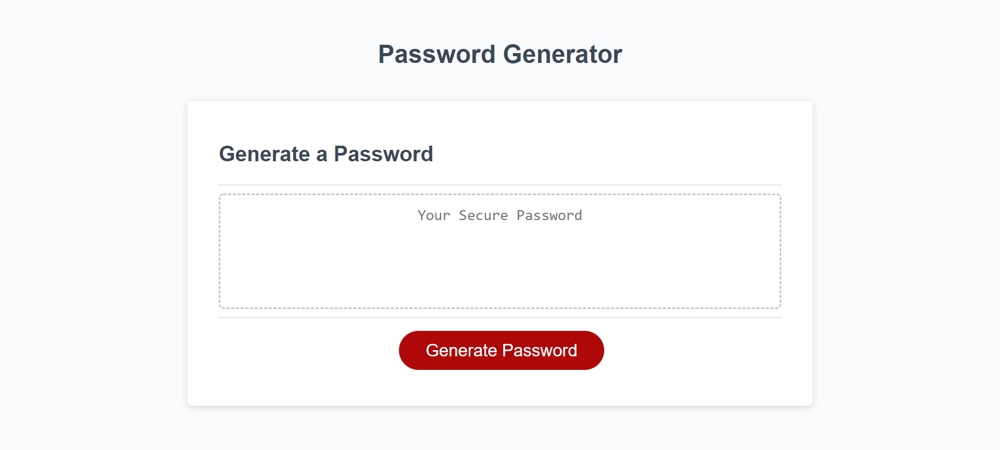
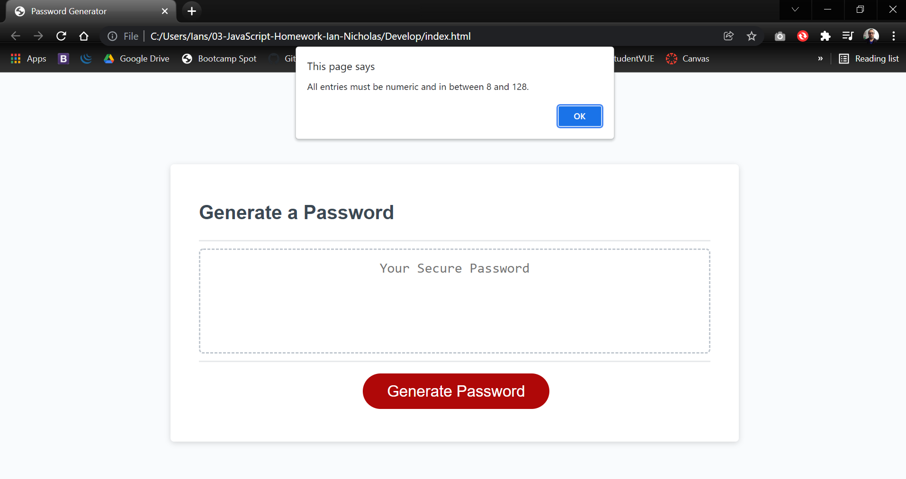

# 03-JavaScript-Homework-Ian-Nicholas

* Assignment asked for a password generator where user enters length of password, number of capitol letters, amount of numbers, number of special characters, and lowercase characters. Then asked to validate if the length is in between 8 and 128 characters, and each entry is a valid digit.

## HTML

* Supplied for us, did not change anything

## CSS

* Supplied for us, did not change anything

## JavaScript

* Line 02, globala variable grabbing #id instance
* Line 04, write passward to the #password input
* Line 08-18, define needed variables
* LIne 20, for loop validating user input, if false give error alert and return to begining of generatePassword funtion
* Line 25-36, loops through each input array and finds random characters defined by user input length
* Line 38, declares variable spliting chars into array
* Line 40, sorts the characters randomly vice top to bottom code
* Line 42, puts back into a string after randomization
* Line 44, assigns generated password to a variable which is then passed to the eventListener, writePassword with the element selected as #password

## Screenshots

* Load page

* Error alert 

* Successful password generation with length 16, capitols = 2, numbers = 2, specials = 2.

